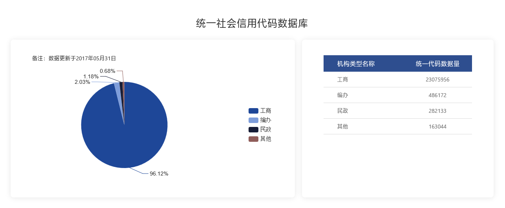
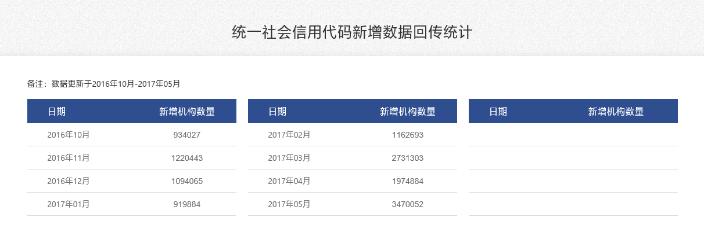

# 企业工商数据采集

## 对[国家企业信用信息公示系统数据采集](http://www.gsxt.gov.cn/index.html)

网站数据展示是通过搜索关键字，数据才会显示在前端页面上，通过输入`企业名称`、`统一社会信用代码`或`注册号`等字段搜索后，将数据显示展示出来，但在点击搜索的时候会出现极限验证的滑动验证码，现在版本是6.0.5的。号称运用了人工智能算法，破解难度很大，所以使用`webdriver`工具，将数据加载在浏览器上，使用工具来模拟人的滑动，因为滑动轨迹是要跟服务器进行验证的，以判断是人还是机器, 所以这种滑动也会出现失败的可能，

滑动验证通过后，得到数据再进行数据提取。
## 全量数据的获取
因为企业信息没有一个列表可以完全翻页获取，即使使用查询关键词也有翻页数的限制。我想的是根据常用汉字，组成关键词，进行搜索，这样搜索一次可以得到50条的企业详情信息的链接，有的冷门关键词搜索出来的数据不到50条，然后根据每个企业详情链接再进去获得打印页的数据，打印页的数据很全，我们就在这个页面进行解析，获取企业的数据，但是还是要过滑动验证码，这些链接是临时生成的，所以获得之后应该及时请求链接，得到数据。一条数据时间在10秒左右，不排除网站的服务器因为性能的问题而出现的延迟。有时访问一条连接，还会出现服务器错误，如果机器性能好，网络延迟低的话会快一点。当一个IP频繁访问的时，网站会出现反爬机制，会拒绝当前IP的访问，所以还需要准备一些可用的IP代理。

## 数据量
根据[全国组织机构代码管理中心](http://www.nacao.org.cn/portal/publish/codeData.html)提供的数据量

而且每个月还会有新增企业数据量

## 其他途径

有些省的公示系统网站使用的是低版本的极限验证库，并且已经被破解了的，我们可以不使用浏览器加载了。直接进行接口验证，绕过图片滑动，采集数据的效率会有所提升。
但各省站点使用的版本和模块略有差异。接口验证的方式有所不同，网页的结构略有差异，维护性差，有可能没过多久，网站对验证码进行升级。可能爬取策略又要改变。

以下还未更新验证码的网站：

**geetest offline 5.9.0**  
+ 上海
+ 河北
+ 内蒙古
+ 辽宁
+ 福建
+ 山东
+ 广东
+ 海南
+ 湖北
+ 湖南
+ 四川
+ 云南
+ 西藏
+ 青海
+ 宁夏

